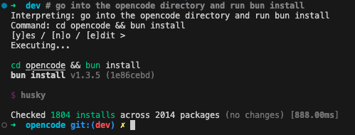

# zsh-nanogpt

A zsh plugin that uses [NanoGPT](https://nano-gpt.com) to interpret natural language commands and execute them.



## Demo

```bash
# go into the opencode directory and run bun install
Thinking...
Interpreting: go into the opencode directory and run bun install
Command: cd opencode && bun install
[y]es / [n]o / [e]dit > y
Executing...
```
## Features

- **Natural language commands** - Prefix with `#` to use AI
- **Rich context awareness** - The LLM knows:
  - Current working directory and files
  - Git branch and uncommitted changes
  - OS/platform (Linux distro, macOS, etc.)
  - Project type (Node.js, Python, Rust, Go, Ruby, etc.)
  - Your recent command history
- **Edit mode** - Press `e` to edit the command before running
- **Safety warnings** - Alerts on dangerous commands like `rm -rf`
- **Command history** - Saves the actual command, not the prompt

## Installation

### Manual

```bash
git clone https://github.com/nanogpt-community/zsh-nanogpt.git ~/.zsh/zsh-nanogpt
echo 'source ~/.zsh/zsh-nanogpt/zsh-nanogpt.plugin.zsh' >> ~/.zshrc
```

### Oh-My-Zsh

```bash
git clone https://github.com/nanogpt-community/zsh-nanogpt.git ${ZSH_CUSTOM:-~/.oh-my-zsh/custom}/plugins/zsh-nanogpt
```

Add to plugins in `~/.zshrc`:
```bash
plugins=(zsh-nanogpt)
```

## Configuration

Config file: `~/.config/zsh-nanogpt/config`

```ini
api_key=your-api-key-here
model=zai-org/glm-4.7
confirm=true
timeout=30
```

| Option | Default | Description |
|--------|---------|-------------|
| `api_key` | (required) | Your NanoGPT API key |
| `model` | `zai-org/glm-4.7` | LLM model to use |
| `confirm` | `true` | Prompt before executing |
| `timeout` | `30` | API timeout in seconds |

## Usage

```bash
# list all files modified today
# find large files over 100MB
# switch to main branch and pull
# compress all images in photos/
```

## Requirements

- `curl`
- `jq` (optional, for better JSON parsing)

## License

MIT
